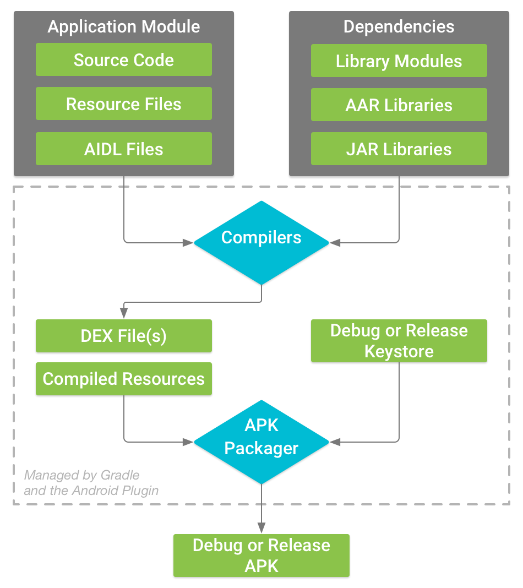
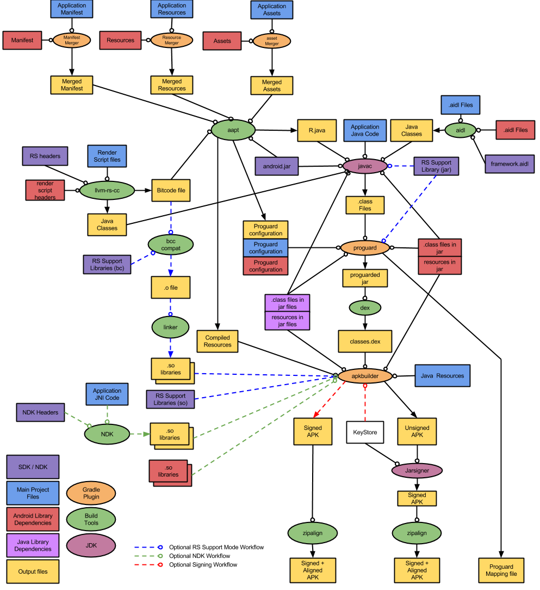

# Apk 打包流程梳理

我们平时在开发的过程中，每天都会run很多次项目，Android Studio就会将apk自动安装到手机上了，那么这中间都经历过哪些流程呢，今天就来梳理记录一下

首先来看一张[官网](https://link.juejin.im/?target=https%3A%2F%2Fdeveloper.android.com%2Fstudio%2Fbuild%2Findex.html%3Fhl%3Dzh-cn%23build-process)（最新）给的构建流程图

1. **编译器将您的源代码转换成 DEX（Dalvik Executable) 文件（其中包括运行在 Android 设备上的字节码），将所有其他内容转换成已编译资源。**
2. **APK 打包器将 DEX 文件和已编译资源合并成单个 APK。不过，必须先签署 APK，才能将应用安装并部署到 Android 设备上。**
3. **APK 打包器使用调试或发布密钥库签署您的 APK：**
   1. **如果您构建的是调试版本的应用（即专用于测试和分析的应用），打包器会使用调试密钥库签署您的应用。Android Studio 自动使用调试密钥库配置新项目。**
   2. **如果您构建的是打算向外发布的发布版本应用，打包器会使用发布密钥库签署您的应用。要创建发布密钥库，请阅读在 Android Studio 中签署您的应用**
4. **在生成最终 APK 之前，打包器会使用 [zipalign](https://link.juejin.im/?target=https%3A%2F%2Fdeveloper.android.com%2Fstudio%2Fcommand-line%2Fzipalign.html%3Fhl%3Dzh-cn) 工具对应用进行优化，减少其在设备上运行时的内存占用。**

再来看一张稍微详细一点（来自老版官网）

从上面的流程图，我们可以看出apk打包流程可以分为以下七步

1. **通过aapt打包res资源文件，生成R.java、resources.arsc和res文件（二进制 & 非二进制如res/raw和pic保持原样）**
2. **处理.aidl文件，生成对应的Java接口文件**
3. **通过Java Compiler编译R.java、Java接口文件、Java源文件，生成.class文件**
4. **通过dex命令，将.class文件和第三方库中的.class文件处理生成classes.dex**
5. **通过apkbuilder工具，将aapt生成的resources.arsc和res文件、assets文件和classes.dex一起打包生成apk**
6. **通过Jarsigner工具，对上面的apk进行debug或release签名**
7. **通过zipalign工具，将签名后的apk进行对齐处理。**

最后看张更详细的

apk打包好了会输出在项目的/app/build/outputs/apk目录下，在Android Studio中我们可以双击apk文件查看当前apk的目录结构，包括各个文件的大小，dex中包含了哪些方法及方法数等，非常方便