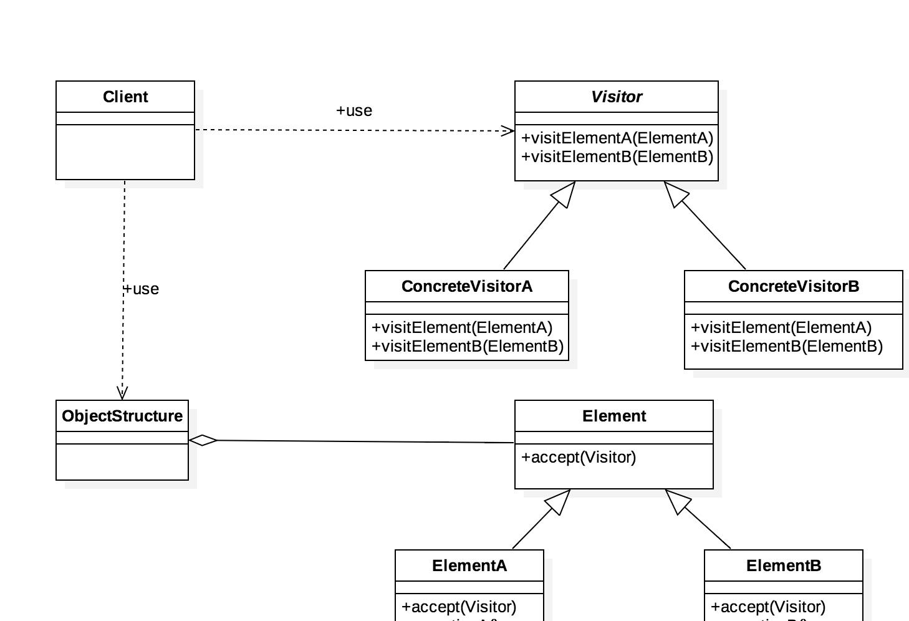

访问者模式

访问者模式是一种将数据操作与数据结构分离的设计模式，这旨设计模式23种模式中最复杂的一个，但它的使用频率并不高。

访问者模式的基本想法是，软件系统中拥有一个由许多对象构成的、比较稳定的对象结构，这些对象的类都拥有一个accept方法用来接受访问者对象的访问。访问者是一个接口，它拥有一个visit方法，这个方法对访问到的对象结构中不同类型元素作出不同的处理。在对象结构的一次访问过程中，我们遍历整个对象结构，对每一个元素都实施accept方法，在每一个元素的accept方法中会调用访问者的visit方法，从而使访问者得以处理对象结构的每一个元素，我们可以针对对象结构 设计不同的访问者来完成不同的操作，达到区别对待的效果。

定义：**封装一些作用于某种数据结构中的各元素的操作，它可以不改变这个数据结构的前提下定义作用于这些元素的新的操作。**

使用场景：

1）对象结构比较稳定，但经常需要在此对象结构上定义新的操作。

2）需要对一个对象结构中的对象进行很多不同的并且不相关的操作，而需要避免这些操作「污染」这些对象的类，也不希望在增加新操作时修改这些类。

UML类图：

角色介绍。

- Visitor:接口或者抽象类，它定义了对每一个元素（Element）访问的行为，它的参数就是可以访问的元素，它的方法个数理论上来讲与元素个数是一样的，因此，访问者模式要求元素的类族要稳定，如果经常添加、移除元素类，必然会导致频繁地修改Visitor接口，如果出现这种情况，则说明不适合使用访问者模式。
- ConcreteVisitor：具体的访问者，它需要给出每个元素类访问时所产生的具体行为。
- Element:元素接口或抽象类，它定义了一个接受访问者（accept）的方法，其意义是指每一个元素都要可以被访问都访问。
- ElementA、ElementB：具体的元素类，它提供接受访问方法的具体实现，而这个具体的实现，通常情况下是使用访问者提供的访问该元素类的方法。
- ObjectStructure：定义当中所提到的对象结构，对象结构是一个抽象表述，它内部管理了元素集合，并且可以迭代这些元素供访问者访问。

