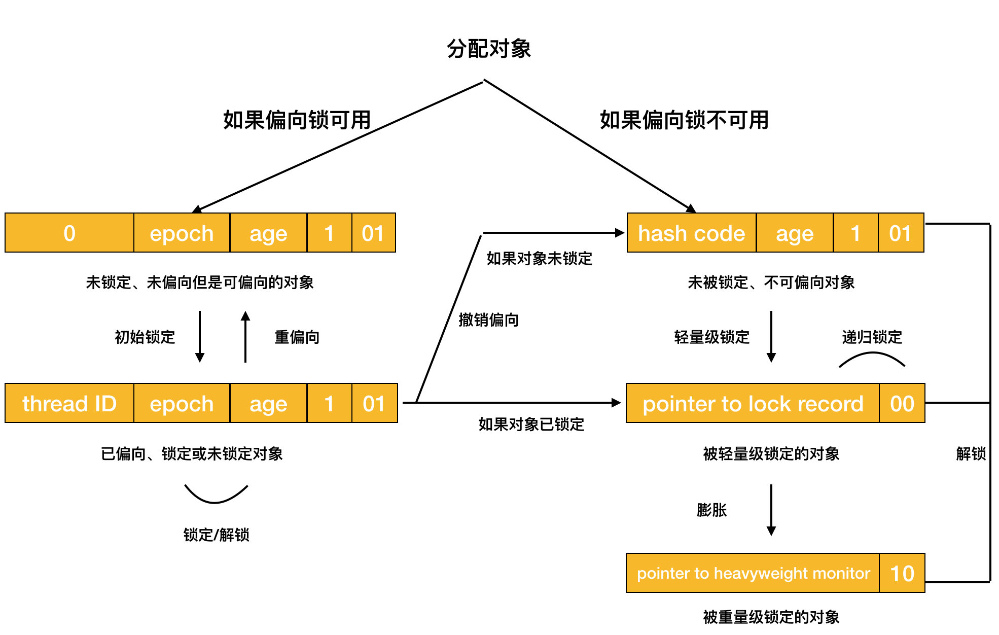
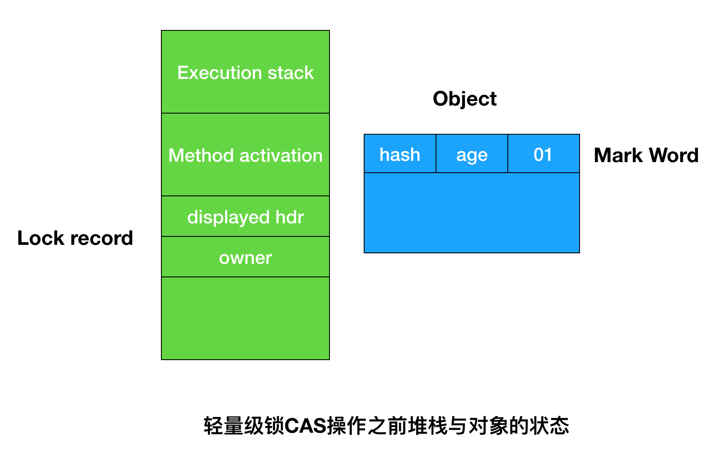
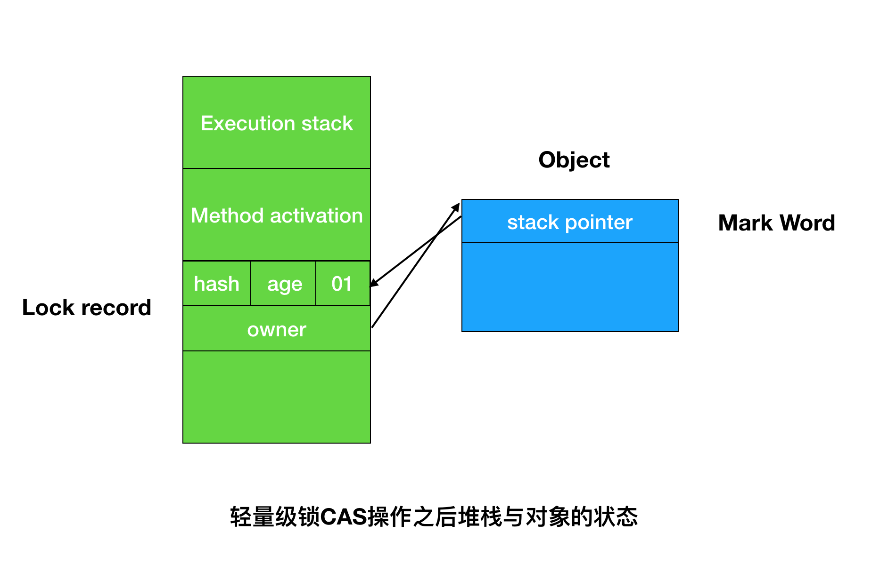

## volatile、synchronized与ReentrantLock


### synchronized

#### synchronized实现原理

synchronized 锁特性由 JVM 负责实现。在 JDK 的不断优化迭代中， synchronized 锁的性能得到极大提升，特别是偏向锁的实现，使得 synchronized 已经不是昔日那个 低性能且笨重的锁了。 JVM底层是通过监视锁来实现 synchronized 同步的。**监视锁即 monitor， 是每个对象与生俱来的一个隐藏字段。**使用 synchronized 时， JVM会根 据 synchronized 的当前使用环境，找到对应对象的 monitor，再根据 monitor 的状态进 行加、解锁的判断。例如，线程在进入同步方法或代码块时，会获取该方法或代码块 所属对象的 monitor， 进行加锁判断。如果成功加锁就成为该 monitor 的唯一持有者。monitor 在被释放前，不能再被其他线程获取。

```
public void testSynchronized();
	descriptor:()V
	flags: ACC_PUBLIC ACC_SYNCHRONIZED
	Code:
		stack=2,locals=2,args_size=1;
		0:getstatic
		...
		monitorenter
		...
		monitorexit
		return
```

方法元信息中会使用 ACC_SYNCHRONIZED 标识该方法是一个同步方法。同步代码块中会使用 monitorenter及 monitorexit两个字节码指令获取和释放 monitor。 如果使用 monitorenter进入时 monitor 为 0，表示该线程可以持有 monitor 后续代码， 并将 monitor 加 1，如果当前线程已经持有了 monitor， 那么 monitor 继续加 1 ;如果 monitor 非 0， 其他线程就会进入阻塞状态。 


#### synchronized优化

JVM对synchronized的优化主要在于对monitor的加锁、解锁上。

##### 自旋锁与自适应自旋

##### 锁消除

##### 锁粗化

##### 偏向锁

HotSpot虚拟机的对象头（Object Header）分两部分信息，第一部分用于存储对象自身的运行时数据，如哈希码（HashCode）、GC分代年龄等，这部分数据的长度在32位和64位的虚拟机中分别为32bit和64bit，官方称为**「Mark Word」**，它是实现轻量级锁和偏向锁的关键。另一部分用于存储指向方法区的对象类型数据的指针，如果是数组对象的话，还会有一个额外的部分用于存储数组长度。

对象头信息是与对象自身定义的数据无关的额外存储成本，考虑到虚拟机的空间效率，Mark Word被设计成一个非固定的数据结构以便在极小的空间内存储尽量多的信息，它会根据对象的状态复用自己的存储空间。例如，在32位的HotSpot虚拟机中对象未被锁定的状态下，Mark Word的32bit空间中的25bit用于存储对象哈希码（HashCode），4bit用于存储对象分代年龄，2bit用于存储锁标志位，1bit固定为0，在其他状态（轻量级锁定、重量级锁定、GC标记、可偏向）下对象的存储内容如下表

| 存储内容                             | 标志位 | 状态               |
| ------------------------------------ | ------ | ------------------ |
| 对象哈希码、对象分代年龄             | 01     | 未锁定             |
| 指向锁记录的指针                     | 00     | 轻量级锁定         |
| 指向重量级锁的指针                   | 10     | 膨胀（重量级锁定） |
| 空、不需要记录信息                   | 11     | GC标记             |
| 偏向线程ID、偏向时间戳、对象分代年龄 | 01     | 可偏向             |


偏向锁也是引入的锁优化，它的目的是消除数据在无竞争情况下的同步原语，进一步提高程序的运行性能。如果说轻量级锁是在无竞争的情况下使用CAS操作去消除同步使用的互斥量，那偏向锁就是在无竞争情况下把整个同步都消除掉，连CAS操作都不做了。

偏向锁的"偏"，就是偏心的"偏"，**它的意思是这个锁会偏向于第一个获得它的线程**，如果在接下来的执行过程中，该锁没有被其他线程获取，则持有偏向锁的线程将永远不需要再进行同步。

假设当前虚拟机启用了偏向锁，那么，当锁对象第一次被线程获取的时候，虚拟机将会把对象头的标志位设为01，即偏向模式。同时使用CAS操作把获取到这个锁的线程的ID记录在对象的Mark Word之中，如果CAS操作成功，持有偏向锁的线程以后每次进入这个锁相关的同步块时，虚拟机都可以不再进行任何同步操作（例如Locking、Unlocking、及对Mark Word的Update等）。

当有**另外**一个线程**尝试**获取这个锁时，**偏向模式就宣告结束**。根据锁对象目前是否处于被锁定的状态，撤销偏向后恢复到未锁定（标志位为01）或轻量级锁定（标志位为00）的状态，后续的同步操作就如轻量级锁那样执行。偏向锁、轻量级锁的状态转化及对象Mark Word的关系如图所示。




##### 轻量级锁

**在代码进入同步块的时候**，如果此同步对象没有被锁定（锁标志位为01状态）虚拟机首先将在当前线程的栈帧中建立一个名为锁记录（Lock Record）的空间，用于存储锁对象目前的Mark Word的拷贝（官方把这份拷贝加上了一个Displayed前缀，即Displayed Mark Word），这时候线程堆栈与对象头的状态如图所示。



然后，虚拟机将使用CAS操作尝试将对象的Mark Word更新为指向Lock Record的指针。如果这个更新动作成功了，那么这个线程就拥有了该对象的锁，并且对象Mard Word的锁标记位将转变以00，即表示此对象处于轻量级锁定状态，这时线程与对象头的状态如图所示



如果这个更新操作失败了，虚拟机首先会检查对象的Mark Word是否指向当前线程的栈帧，如果是说明当前线程已经拥有了这个对象的锁，那就可以直接进入同步块继续执行，否则说明这个锁对象已经被其他线程抢占了。如果有两条以上的线程争用同一个锁，那轻量级锁就不再有效，要膨胀为重量级锁，锁标志状态值变为10，Mark Word中存储的就是指向重量级锁（互斥锁）的指针，后面等待锁的线程也要进入阻塞状态。

上面描述的是轻量级锁的加锁过程，它的解锁过程也是通过CAS操作来进行的，如果对象的Mark Word仍然指向着线程的锁记录，那就用CAS操作把当前的Mark Word和线程中复制的Displayed Mark Word替换回来，如果替换成功，整个同步过程就完成了。如果替换失败，说明有其他线程尝试过获取该锁，那就要在释放锁的同时，唤醒被挂起的线程。

轻量级锁能提升程序**同步性能**的依据是"对于绝大部分的锁，在整个同步周期内都是不存在竞争的"，这是一个经验数据。如果没有竞争，轻量级锁使用CAS避免互拆量的开销。


##### 重量级锁


### volatile

先从happen before 了解线程操作的可见性。把happen before定义为方法hb(a,b)，表示a happen before b。如果hb(a,b)且hb(b,c)，能的推导出hb(a,c)。类似于x>y且y>z，可以推导出x>z。这不就是一种放之四海而皆准的规律吗？但其实很场景并不符合这种规律，比如在2018年俄罗斯世界杯上，韩国队战胜德国队，德国队战胜瑞典队，并不能推导出韩国队战胜了瑞典队。

线程执行或线程切换都是纳秒级的，执行速度如此之快，直觉上会认为线程本地缓存的必要性特别弱。做个类比，我们人类以年为计而宇宙以亿为计，宇宙老人看待人类的心态不正如我们看待CPU世界的心态么？时间成本巨大差异只要存在，缓存策略自然就会产生。再比如，去学校图书馆仅需要10分钟，借一本书，无须缓存。但如果去市图书馆，往返需要5个小时，一般为了减少路程开销而会考虑多借几本。CPU访问内存远远比访问高速缓存L1和L2慢的多，对应借书的例子，应该去国外图书馆了。

接着再谈指令优化。计算机并不会根据代码顺序按部就班地执行相关指令，再回到借书例子，假如你刚好要去还书，然后再借一本，你的室友恰好也让你帮他归还书，然后再借一本。这个过程有两件事：你的事和他的事。先办完你的事，再办他的事，是一种单线程的死板行为。此时你们潜意识地进行「指令优化」：把你要还的书和他要还的一起归还，再一起借你们要借的书，这相当于合并数据进行存取的操作过程。CPU在处理信息时也会进行指令优化，分析哪些数据读取动作可以合并进行，哪些存数据动作可以合并进行。CPU拜访一趟遥远的内存，一定会到处看看，是否可以存取合并，以提高执行效率。指令重排示例代码如下：

```java
public void run(){
	//第1处
  int x = 1;
  int y = 2;
  int z = 3;
  //第2处
  x = x + 1;
  //第3处
  int sum = x + y + z;
}
```

happen before 是时钟顺序的先后，并不能保证线程交互的可见性。在第2处和第3处都是写操作，不会进行指令重排，但是前三行是不互斥的，并且第1处的操作如查放在z赋值操作之后，明显是效率最大化的处理方式。所以指令重排的最大可能性是把第1处和第2处串联依次执行。happen before并不能保证线程交互的可见性。那么什么是可见性呢？可见性是指某线程修改共享变量的指令对其他线程来说都是可见的，它反映的是指令执行的实时透明度。

每个线程都有独占的内存区域，如操作栈、本地变量表等。线程本地内存保存了引用变量在堆内存中的副本，线程对变量的所有操作都在本地内存区域中进行，执行结束后再同步到堆内存中去。这里必然有一个时间差，在这个时间差内，该线程对副本的操作，对于其他线程是不同见的。

volatile 延伸意为「敏感的」。当使用volatile修饰变量时，意味着任何对此变量的操作都会在内存中进行，不会产生副本，以保证共享变量的可见性，局部阻止了指令重排的发生。由此可知，在使用单例设计模式时，即使使用双检锁也不一定会拿到最新的数据。

```java
class LazyInitDemo{
	private static TransactionService service = null;
  public static TransactionService getTransactionService(){
    if(service == null){
      synchronized(this){
        if(service == null){
          service = new TransactionService();
        }
      }
    }
    return service;
  }
}
```

使用者在调用getTransactionService()时，有可能会得到初始化未完成的对象。究其原因，与java虚拟机的编译优化有关。对Java编译器而言，初始化TransactionService实例和将对象地址写到service字段并非原子操作，且这两个阶段的执行顺序是未定义的。假设某个线程执行new TransactionService()时，构造方法还未被调用，编译器仅仅为该对象分配了内存空间并设为默认值，此时若另一个线程调用getTransactionService()方法，由于service != null ，但此时service对象还没有被赋予真正的有效值，从而无法取到正确的service单例对象。这就是著名的双重检查锁定（Double-check Locking）问题，对象引用在没有同步的情况下进行读操作，导致用户可能会获取未构造完成的对象。对于此问题，一种较为简单的解决方案是用volatile关键字修饰目标属性，这样service就限制了编译器对它的相关操作，对它的读写操作进行指令重排，确定对象实例化之后才返回引用。

锁也可以确保变量的可见性，但是实现方式和volatile略有不同。线程在得到锁时读入副本，释放时写回内存，锁的操作尤其要符合happen before原则。

volatile解决的是多线程的共享变量可见性问题，类似于synchronized，但是不具备synchronized的互斥性。所以对volatile的变量的操作并非都具有原子性，这是一个容易犯错误的地方。一个线程对共享变量进行10000次i++操作，另一个线程进行10000次i—操作。声明volatile后发现结果不为0

能实现count++原子操作的其他类有AtomicLong和LongAdder。JDK8推荐使用LongAdder类，它比AtomicLong性能更好，有效地减少了乐观锁的重试次数。

因此，「volatile是轻量级的同步方式」这种说法是错误的，它只是轻量级的线程的操作可见方式，并非同步方式，如果是多写场景，一定会产生线程安全问题。如果是一写多读的并发场景，使用volatile修饰变量则非常合适。volatile一写多读最典型的应用是CopyOnWriteArrayList。它在修改数据时会把整个集合的数据全部复制出来，对写操作加锁，修改完后，再用setArray()把array指向新的集合。使用volatile可以使读线程尽快的感知array的修改，不进行指令重排，操作后即对其他线程可见。

```java
public class CopyOnWriteArrayList{
	private transient volatile Object[] array;
  
  final void setArray(Object[] a){
    arrayl = a;
  }
}
```

在实际业务中，如何清晰地判断一写多读的场景显得尤为重要。如果不确定共享变量是否会被多个线程并发写，保险的做法是使用同步代码块来实现线程同步。另外，因为所有的操作都需要同步给内存变量，所以volatile一定会使线程执行速度变慢，故要审慎定义和使用volatile