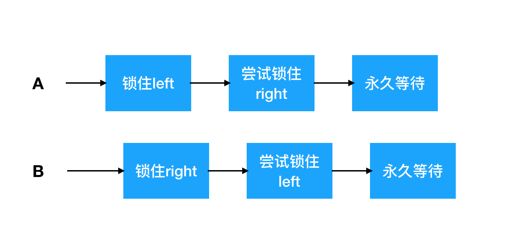

## 死锁详谈


当一个线程永远地持有一个锁，并且其他线程都尝试获得这个锁时，那么它们将永远被阻塞。在线程A持有锁L并想获得锁M的同时，线程B持有锁M并尝试获得锁L，那么这两个线程将永远地等待下去。这种情况就是最简单的死锁形式


### 1.锁顺序死锁

先来看代码

```java
public class LeftRightDeadLock{
	private final Object left = new Object();
  private final Object right = new Object();
  
  public void leftRight(){
    synchronized(left){
      synchronized(right){
        doSomething();
      }
    }
  }
  
  public void rightLeft(){
    synchronized(right){
      synchronized(left){
        doSomething();
      }
    }
  }
}
```

LeftRightDeadLock存在死锁风险。leftRight和rightLeft这两个方法分别获得了left锁和right锁。如果一个线程调用了leftRight，而另一个线程调用了rightLeft，并且这两个线程的操作是交错执行，如图所示，那么它们会发生死锁。



在LeftRightDeadlock中发生死锁的原因是:**两个线程试图以不同的顺序来获得相同的锁。如果按照相同的顺序来请求锁，那么就不会出现循环的加锁依赖性，因此也就不会产生死锁。如果每个需要锁L和M的线程都以相同的顺序来获取L和M，那么就不会发生死锁了。**


### 2.动态的锁顺序死锁


```java
public void transferMoney(Account fromAccount,Account toAccount,DollarAmount amount){
	synchronized(fromAccount){
    synchronized(toAccount){
      if(fromAccount.getBalance().compareTo(acount)<0){
        throw Exception();
      }else{
        fromAccount.debit(amount);
        toAccount.credit(amount);
      }
    }
  }
}
```

有时候，并不能清楚地知道是否在锁顺序上有足够的控制权来避免死锁的发生。程序中看似无害的代码，它将资金从一个账户转入另一个账户。在开始转账前，首先要获得这两个Account对象的锁，以确保通过原子方式来更新两个账户中的余额。

在transferMoney中如何发生死锁？所有的线程似乎都是按照相同的顺序来获得锁，但事实上锁的顺序取决于传递给transferMoney的参数顺序，而这些参数顺序又取决于外部输入。如果两个线程同时调用transferMoney，其中一个线程从X向Y转账，另一个线程从Y向X转账，那么就会发生死锁：

```
A:transferMoney(myAccount,yourAccount,10);
B:transferMoney(yourAccount,myAccount,20);
```

如果执行时序不当，那么A可能获得myAccount的锁并等待yourAccount锁，然而B此时持有yourAccount的锁，并正等待myAccount的锁。

由于我们无法控制参数的顺序，因此要解决这个问题，必须定义锁的顺序，并在整个应用程序中都按照这个顺序来获取锁。

在制定锁的顺序时，可以使用**System.identitiyHashCode**方法，该方法将返回由Object.hashCode的返回值。下面代码消除了死锁的可能性。

```java
private static final Object tieLock = new Object();

public void transferMoney(final Account fromAcct,final Account toAcct,final DollarAmount amount){
  class Helper{
    public void transfer(){
      if(fromAcct.getBalance().compareTo(amount)<0){
        throw Exception();
      }else{
        fromAcct.debit(amount);
        toAcct.credit(amount);
      }
    }
  }
  
  int fromHash = System.identityHashCode(fromAcct);
  int toHash = System.identityHashCode(toAcct);
  
  if(fromHash < toHash){
    synchronized(fromAcct){
      synchronized(toAcct){
        new Helper().transfer();
      }
    }
  }else if(fromHash > toHash){
    synchronized(toAcct){
      synchronized(fromAcct){
        new Helper().transfer();
      }
    }
  }else{
    synchronized(tieLock){
      synchronized(fromAcct){
        synchronized(toAcct){
          new Helper().transfer();
        }
      }
    }
  }
}
```

在极少数情况下，两个对象可能拥胡相同的散列值，此时必须通过某种任意的方法来决定锁的顺序，而这可能又会重新引入死锁。为了避免这种情况，可以使用「加时赛」锁。在获得两个Account锁之前，首先获得这个「加时赛」锁，从而保证每次只有一个线程以未知的顺序获得这两个锁，从而消除了死锁发生的可能性。


### 3.在协作对象之间发生的死锁


某些获取多个锁的操作并不像在LeftRightDeadLock或transferMoney中那么明显，这两个锁并不一定必须在同一个方法中被获取。

```java
class Taxi{
  private Point location,destination;
  private final Dispatcher dispatcher;
  
  public Taxi(Dispatcher dispatcher){
    this.dispatcher = dispatcher;
  }
  
  public synchronized Point getLocation(){
    return location;
  }
  
  public synchronized void setLocation(Point location){
    this.location = location;
    if(location.equals(destination)){
      dispatcher.notifyAvailiable(this);
    }
  }
}

class Dispatcher{
  private final Set<Taxi> taxis;
  private final Set<Taxi> availableTaxis;
  
  public Dispatcher(){
    taxis = new HashSet<Taxi>();
    avilableTaxis = new HashSet<Taxi>();
  }
  
  public synchronized void notifyAvailable(Taxi taxi){
    availabeTaxis.add(taxi);
  }
  
  public synchronized Image getImage(){
    Image image = new Image();
    for(Taxi t : taxis){
      image.drawMarker(t.getLocation());
    }
    
    return image;
  }
}
```

尽管没有任何方法会显式地获取两个锁，但setLocation和getImage等方法的调用者都会获得两个锁。如果一个线程在收到GPS接收器的更新事件时调用setLocation，那么它将首先更新出租车的位置，然后判断它是否到达了目的地。如果已经到达，它会通知Dispatcher：它需要一个新的目的地。因为setLocation和notifyAvailiable都是同步方法，因此调用setLocation的线程将首先获取Taxi的锁，然后获取Dispatcher的锁。同样，调用getImage的线程将首先获取Dispatcher的锁，然后再获取每一个Taxi的锁（每次获取一个）。这与LeftRightDeadLock中的情况相同，两个线程按照不同的顺序来获取两个锁，因此就可能产生死锁。

> 如果在持有锁时调用某个外部方法，那么将出现活跃性问题。在这个外部方法中可能会获取其他锁（这可能会产生死锁），或者阻塞时间过长，导致其他线程无法及时获得当前被支持有的锁。


### 4.开放调用

如果在调用某个方法时不需要持有锁，那么这种调用被称为开放调用。依赖于开放调用的类通常能表现出更好的行为，并且与那些在调用方法时需要持有锁的类相比，也更易于编写。这种通过开放调用来避免死锁的方法，类似于采用封装机制来提供线程安全的方法：虽然在没有封装的情况下也能确保构建线程安全的程序，但对一个使用了封装的程序进行线程安全分析，要比分析没有使用封装的程序容易得多。同理，分析一个完全依赖于开发调用的程序的活跃性，要比分析那些不依赖开放调用的程序的活跃性简单。通过尽可能地使用开放调用，将更易于找出那些需要获取多个锁的代码路径，因此也就更容易确保采用一致的顺序来获得锁。

```java
class Taxi{
  private Point location,destination;
  private final Dispatcher dispatcher;
  ...
    
  public synchronized Point getLocation(){
    return location;
  }
  
  public void setLocation(Point locaiton){
    boolean reachedDestination;
    synchronized(this){//这里线程A先获取Taxi锁
      this.locaition = location;
      reachedDestination = location.equals(destination);
    }
    
   	if(reachedDestination){
      dispatcher.notifyAvailiable(this);//获取Dispatcher锁
    }
  }
}


class Dispatcher{
  private final Set<Taxi> taxis;
  private final Set<Taxi> availiableTaxis;
  
  public synchronized void notifyAvailiable(Taxi taxi){
    availiableTaxis.add(taxi);
  }
  
  public Image getImage(){
    Set<Taxi> copy;
    synchronized(this){//获取Dispatcher锁
      copy = new HashSet<Taxi>(taxis);
    }
    Image image = new Image();
    for(Taxi t : copy){
      image.drawMarker(t.getLocation());//获取Taxi锁
    }
    return image;
  }
}
```

将Taxi和Dispatcher修改为使用开放调用，从而消除发生死锁的风险。这需要使用同步代码块仅被用于保护那些涉及共享状态的操作。通常，如果只是为了语法紧凑或简单性（而不是因为整个方法必须通过一个锁来保护）而使用同步方法（而不是同步代码块），那么就会导致协作对象死锁问题。

有时候，在重新编写同步代码块以使用开放调用时会产生意想不到的结果，因为这会使得某个原子操作变为非原子操作。在许多情况下，使某个操作失去原子性是可以接受的。例如，对于两个操作并不需要实现为一个原子操作。在其他情况中，虽然去掉原子性可能会出殃一些值得注意的结果 ，但这种语义变化仍然是可以接受的。在容易产生死锁的版本中，getImage会生成某个时刻下的整个车队位置的完整快照，而在重新改写的版本中，getImage将获得每辆出租车不同时刻的位置。


