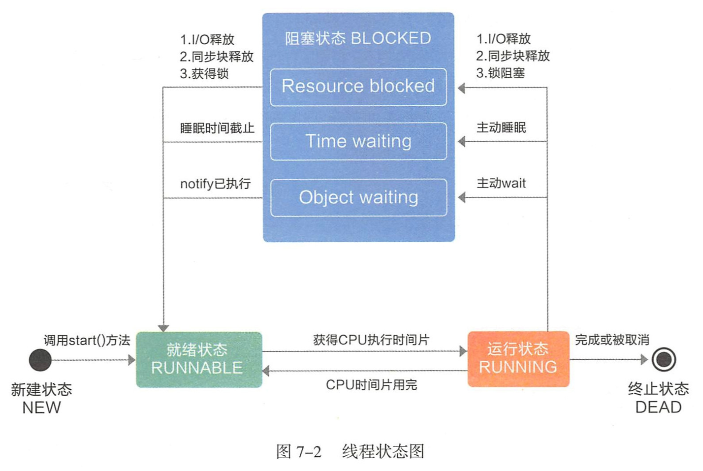

## 线程五种状态


有 NEW (新建状态)、 RUNNABLE (就绪状态)、 RUNNING (运行状态)、BLOCKED (阻塞状态)、 DEAD (终止状态)五种状态。





**( I )NEW ， 即新建状态，是线和被创建旦未启动的状态。**

```
创建线程的方式有三种: 第一种是继承自 Thread 类，第二种是实现 Runnable 接口，第三种是实现 Callable 接 口。相比第一种，推荐第二种方式，因为继承自 Thread类往往不符合里氏代换原则， 而实现 Runnable 接口可以使编程更加灵活，对外暴露的细节比较少，让使用者专注 于实现线程的 run()方法上。第三种 Callable 接口的 call() 声明如下，
V call() throws Exception;

由此可知， Callable 与 Runnable 有 两点不同 第-，可以通过 call()获得 返回值。前两种方式都有 个共同的缺陷，即在任务执行完成后 ，无法直接获 取执行结果 ， 需要借助共享变量等获取 ，而 Callable 和 Future 则 很好地解决了 这个问题; 第二， call()可以抛出异常。而 Runnable 只有通过setDefaultUncaughtExceptionHandler() 的方式才能在主线程中捕捉到子线程异常。
```

**( 2 ) RUNNABLE， 即就绪状态 ， 是调用 start() 之后运行之前的状态。** 

```
线程的 start()不能被多次调用，否则会抛出 Illega!StateException异常。
```

**( 3 ) RUNNING ， 即运行状态 ， 是 run() 正在执行时线程的状态。** 

```
线程可能会由 于某些因素而退出 RUNNING，如时间、异常、锁、调度等。
```

**( 4 ) BLOCKED ，即阻塞状态 ， 进入此状态 ， 有以下种情况。**

- 同步阻塞:锁被其他线程占用。
- 主动阻塞:调用 Thread 的某些方法，主动让出 CPU 执行权 ，比如 sleep()、join() 等。
- 等待阻塞:执行了 wait()。

**( 5 ) DEAD，即终止状态，是 run()执行结束，或同异常退出后的状态 ， 此状态不可逆转。**


